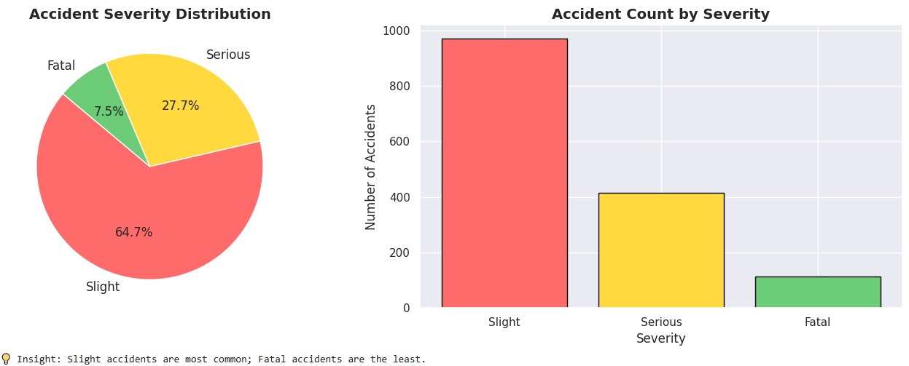
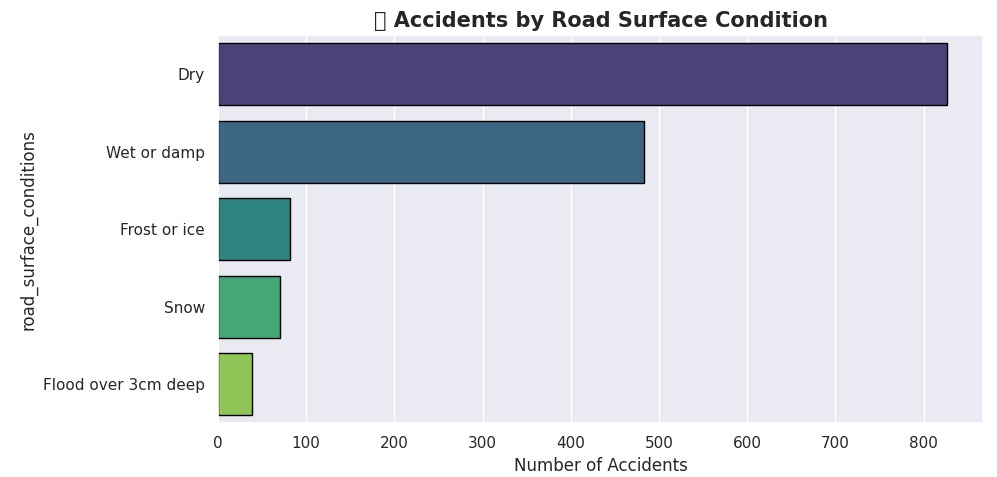
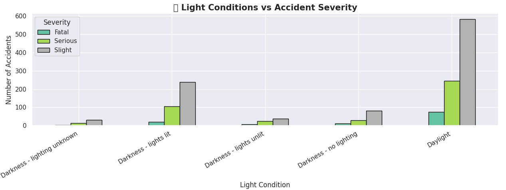

# Road-Accident-EDA
Exploratory Data Analysis on UK Road Accident Data using Python
# 🚗 Road Accident Analysis — EDA

## 📌 Overview
Exploratory Data Analysis on UK Road Accident data to uncover
patterns related to severity, weather, time, and vehicle types.

## 🛠️ Tools Used
- Python, Pandas, NumPy
- Matplotlib, Seaborn, Plotly
- Google Colab

## 📊 Key Visualizations

### 1️⃣ Accident Severity Distribution

### 2️⃣Road Surface Conditions vs Accidents

### 3️⃣ Light Conditions vs Accidents Severity

### 4️⃣ Key Insights Summary

## 🔍 Key Findings
- Slight accidents are the most common (65%)
- Rush hours (8–9 AM & 5–6 PM) are the most dangerous
- Most accidents occur in fine weather (driver overconfidence)
- Cars are the most frequently involved vehicle type

## 📁 Dataset
Sample UK Road Accident Dataset — 1,500 records × 12 features

## ▶️ How to Run
1. Open Road_Accident_EDA.ipynb in Google Colab
2. Upload road_accident_data.csv when prompted
3. Run all cells
4. Click **"Commit changes"** → **"Commit directly to main"** → ✅

---

